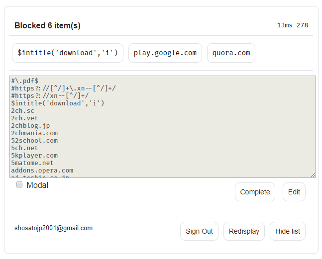
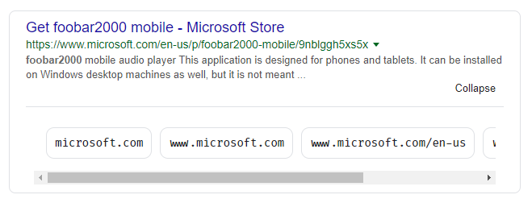
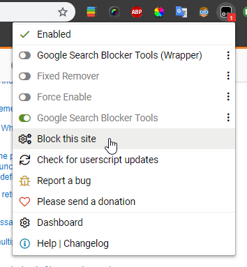
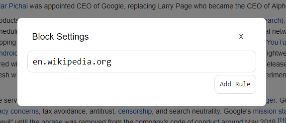
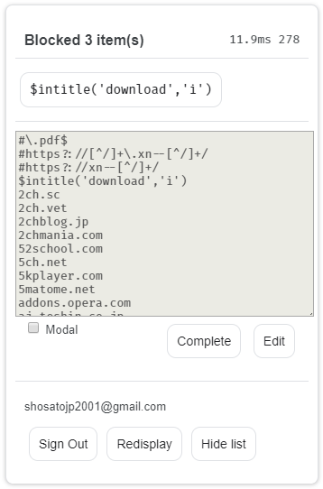
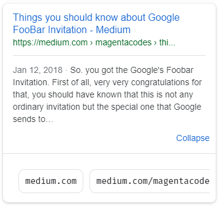

# Google Search Blocker
Google Search Blocker blocks sites you don't want to see in google results. You can use this script not only on **google.com** but **bing.com** and **yahoo.co.jp**. This script is also available on **mobile** (Android Firefox (changing useragent to Android Chrome is recommended.)). 

  

## Get Started

### 1.Install Tampermonkey on your browser
Chrome:
https://chrome.google.com/webstore/detail/tampermonkey/dhdgffkkebhmkfjojejmpbldmpobfkfo

Firefox:
https://addons.mozilla.org/ja/firefox/addon/tampermonkey/
### 2.Click this URL to install script.
https://github.com/shosatojp/google_search_blocker/raw/master/google_search_blocker.user.js?

### Edit Quickly On Google Search Result Page
  

### Auto Block Level Selector
  
You only need to click button to block domain.

## How to write rules
| Block by:       | Rule                                                                                                                                                         | Speed  |
| --------------- | ------------------------------------------------------------------------------------------------------------------------------------------------------------ | ------ |
| Domain          | `example.com`<br>`foo.example.com`                                                                                                                           | fast   |
| PDF             | `#\.pdf`                                                                                                                                                     | slow   |
| IDN             | `#https?://xn--[0-9a-z.]+/`                                                                                                                                  | slow   |
| Title           | `$intitle('foo')`<br>`example.com$intitle('foo')`                                                                                                            | middle |
| Content         | `$inbody('foo')`<br>`example.com$inbody('foo')`                                                                                                              | middle |
| Title + Content | `$intext('foo')`<br>`example.com$intext('foo')`                                                                                                              | middle |
| URL             | `$inurl('/wp-content/uploads/')`<br>`example.com$inurl('/wp-content/uploads/')`                                                                              | middle |
| Pathname        | `$pathname('/')`                                                                                                                                             | middle |
| Pathname Prefix | `$prefix('/search')`                                                                                                                                         | middle |
| Pathname Suffix | `$suffix('.pdf')`                                                                                                                                            | middle |
| Domain          | `$domain('jp')`                                                                                                                                              | middle |
| Domain Prefix   | `$domainp('shop.')`                                                                                                                                          | middle |
| Domain Suffix   | `$domains('.jp')`                                                                                                                                            | middle |
| Domain String   | `$indomain('xn--')`<br>`$indomain('[a-z]{2}','')`                                                                                                            | middle |
| Script          | `$script('~$.indexOf("bar")')`<br>`example.com$script('~$.indexOf("bar")')`                                                                                  | slow   |
| Regex           | `#https?.+`<br>`$intitle('foo','')`<br>`example.com$intitle('foo','')`<br>`$inbody('foo','i')`<br>`$intext('w3schools','m')`<br>`$inurl('w3schools','igmy')`<br>`$pathname('.*/issues/','')` | slow   |
| (Comment)       | `!example.com`                                                                                                                                               |        |

`#...` is alias of `$inurl(...,'')`

### Logical Operators
|      | Operator       |
| ---- | -------------- |
| AND  | `and(...args)`  |
| OR   | `or(...args)`   |
| NOT  | `not(arg)`      |
| XOR  | `xor(...args)`  |
| NAND | `nand(...args)` |
| NOR  | `nor(...args)`  |

#### Usage
```js
//this rule blocks `foo.example.com` too. but not blocks `fooexample.com`
example.com
foo.example.com

// `*example.com/content*`
example.com$prefix('/content')

foo.example.com$intitle('download')

// regex, ignore case
$inurl('foo','i')

//block all
$script('true')

// complex logical operators are allowed
$xor(or(and(intitle('foo', 'i'), not(inbody('bar'))), prefix('/content')), suffix('.html'))
```

## Environment
You can change block list by what you are searching. For example, you are writing reports, you can apply block list which blocks sites except for such as .edu .gov, but you can apply a slightly more loose block list when surfing the net.
```js
==<Environment name>(...Base Environments)==
```
```js
==main== // Optional, added automatically
example.com

==report== // Environment for writing report. Environment name is arbitrary.
$nor(domain('edu'),domain('gov'),domain('ac.jp'),domain('go.jp'))

==sub(main,report)== // Inherits `main` and `report` environments.
hoge.com
foo.com
```
## Sync
You need google account to sync block list. This script sync using your google drive storage. After sync a file named `GoogleSearchBlocker.txt` will be created at the root of your storage, but you can move this file anywhere excludes trash box.

## Available Environments

| OS      | Browser  |     | Sites                                            |
| ------- | -------- | --- | ------------------------------------------------ |
| Windows | Chrome   | O   | google.com, google.co.jp, bing.com, yahoo.co.jp  |
|         | Firefox  | O   | google.com, google.co.jp, bing.com*, yahoo.co.jp |
|         | Edge     | O   | google.com, google.co.jp, bing.com*, yahoo.co.jp |
|         | Opera    | X   |                                                  |
|         | Vivaldi  | O   | google.com, google.co.jp, bing.com*, yahoo.co.jp |
|         | Waterfox | O   | google.com, google.co.jp, bing.com*, yahoo.co.jp |
|         | Sleipnir | O   | google.com, google.co.jp, bing.com*, yahoo.co.jp |
| Android | Firefox  | O   | google.com, google.co.jp, bing.com, yahoo.co.jp  |
| OSX | (probably)  | O   | Sorry, I don't have mac.  |

### * Why this script cannot sync in bing.com by itself:
This script use `document.body.appendChild` to load Google API. bing.com overrides `Element.prototype.appendChild` at html sctipt tag, and because browser extensions will be injected async, this script cannot copy original and use `appendChild` properly. Nevertheless, you want to use sync in bing.com, you have to add this line to uBlockOrigin's "my filter".

#### Add this to "my filter" of uBlockOrigin.
> `||www.bing.com/search$inline-script`

## Google Search Blocker Tools Extension
If you install [Google Search Blocker Tools](https://github.com/shosatojp/google_search_blocker/raw/master/google_search_blocker_tools.user.js?) extension, you can add rule to blocklist when you are not in search result page.  
  
  

## Available on mobile too (Android Firefox)
  
  


## Scheduled Update
* 

Please request for new features via 'issue'.
