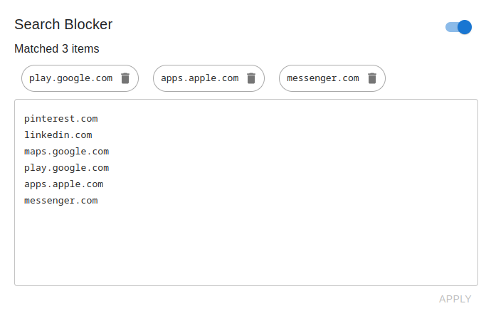

# Search Blocker

## Supported Sites

- [Google](https://www.google.com/)
  - all domains listed in https://www.google.com/supported_domains
  - desktop, mobile
- [Bing](https://www.bing.com/)
- [Yahoo!](https://search.yahoo.com/)
- [Yahoo! Japan](https://search.yahoo.co.jp/)
- [DuckDuckGo](https://duckduckgo.com/)

## Features



block rule candidates


## Get Started

1. Install Tampermonkey on your browser
    - Chrome: https://chrome.google.com/webstore/detail/tampermonkey/dhdgffkkebhmkfjojejmpbldmpobfkfo
    - Firefox: https://addons.mozilla.org/ja/firefox/addon/tampermonkey/
2. Click this URL to install script.
   - [search-blocker.user.js](https://github.com/shosatojp/search-blocker/releases/latest/download/search-blocker.user.js)

## Rule Syntax

```sh
# this is comment

foo.example.com

# also blocks foo.example.com
example.com

# block if 'foobar' appears in title
$intitle('foobar')

# mixed
example.com$intitle('foobar')
```

## Development

```sh
python tools/tampermonkey.py header > tampermonkey/header.js
python tools/tampermonkey.py matches > chrome/matches.json

npm run build

python tools/tampermonkey.py wrapper --path dist/search-blocker.user.js > tampermonkey/wrapper.user.js
```
